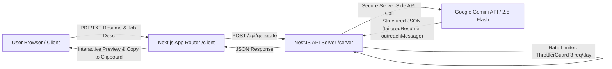

# Bespoke — AI Tailored Resume & LinkedIn Outreach Generator

**Bespoke** is a modern full-stack web application that helps job seekers instantly transform their standard resume into an ATS-optimized, high-impact resume tailored specifically to any job description, while generating a personalized LinkedIn outreach message to connect with recruiters and hiring managers.

---

## 🏛️ Architecture Overview



- **Frontend (`/client`)**: Next.js 14 (App Router), TypeScript, Tailwind CSS, `pdfjs-dist` for client-side PDF/TXT resume text extraction. Zero API keys are stored in the browser.
- **Backend (`/server`)**: NestJS (TypeScript), `@nestjs/throttler` for IP-based rate limiting (3 requests/day), `class-validator` for DTO validation, `@google/generative-ai` SDK using `GEMINI_API_KEY` from `ConfigModule`, and structured exception handling.

---

## 🚀 Quick Start (Local Development)

### 1. Prerequisites
- **Node.js**: v18+ or v20+ (v24 tested)
- **npm** or **pnpm** / **yarn**
- A **Google Gemini API Key** (Get free at [Google AI Studio](https://aistudio.google.com/app/apikey))

### 2. Backend Setup (`/server`)

1. Open a terminal and navigate to the server folder:
   ```bash
   cd server
   ```
2. Install dependencies:
   ```bash
   npm install
   ```
3. Create your `.env` file from the example:
   ```bash
   cp .env.example .env
   ```
4. Edit `.env` and paste your Gemini API key:
   ```env
   GEMINI_API_KEY=your_actual_gemini_api_key
   PORT=3001
   FRONTEND_URL=http://localhost:3000
   GEMINI_MODEL=gemini-2.5-flash
   ```
5. Start the development server:
   ```bash
   npm run start:dev
   ```
   The backend API will run on `http://localhost:3001/api`.

### 3. Frontend Setup (`/client`)

1. Open a second terminal and navigate to the client folder:
   ```bash
   cd client
   ```
2. Install dependencies:
   ```bash
   npm install
   ```
3. (Optional) Create `.env.local` if needed (defaults to `http://localhost:3001`):
   ```env
   NEXT_PUBLIC_API_URL=http://localhost:3001
   ```
4. Start the Next.js development server:
   ```bash
   npm run dev
   ```
5. Open your browser and visit `http://localhost:3000`.

---

## ☁️ Production Deployment Guide

### Deploying the Backend (`/server`) to Render (Free Tier)

1. Push your repository to **GitHub** or **GitLab**.
2. Go to [Render Dashboard](https://dashboard.render.com/) and click **New +** -> **Web Service**.
3. Connect your repository.
4. Configure the service settings:
   - **Name**: `bespoke-api`
   - **Root Directory**: `server`
   - **Environment**: `Node`
   - **Build Command**: `npm install && npm run build`
   - **Start Command**: `npm run start:prod`
   - **Plan**: `Free`
5. Under **Environment Variables**, add:
   - `GEMINI_API_KEY`: *(Your Google Gemini API Key)*
   - `PORT`: `10000` (or leave default, Render sets `PORT` automatically)
   - `FRONTEND_URL`: `https://your-bespoke-app.vercel.app` *(Your Vercel frontend URL)*
6. Click **Deploy Web Service**.
7. Copy your Render URL (e.g. `https://bespoke-api.onrender.com`).

*(Alternative: You can deploy `/server` to **Railway** by selecting "Deploy from GitHub repo", setting Root Directory to `server`, and adding `GEMINI_API_KEY`).*

---

### Deploying the Frontend (`/client`) to Vercel

1. Go to [Vercel Dashboard](https://vercel.com/) and click **Add New...** -> **Project**.
2. Import your GitHub repository.
3. In the project configuration:
   - **Root Directory**: Click "Edit" and select `client`.
   - **Framework Preset**: `Next.js`
4. Under **Environment Variables**, add:
   - `NEXT_PUBLIC_API_URL`: `https://bespoke-api.onrender.com` *(The URL of your deployed NestJS backend)*
5. Click **Deploy**.
6. Once deployed, update the `FRONTEND_URL` variable in your Render backend settings to match your new Vercel domain!

---

## 🛡️ Security & Rate Limiting

- **Zero Client-Side Keys**: Frontend never interacts with Gemini API directly. The `GEMINI_API_KEY` is kept safe inside the backend server environment.
- **Throttling**: `@nestjs/throttler` enforces a max rate limit of 3 requests per 24 hours per IP address to prevent quota exhaustion.
- **Client UX Limit**: The frontend tracks 3 generations in `localStorage` to give users instant visual feedback with a contact banner.
- **Input Sanitization**: NestJS `ValidationPipe` with `class-validator` ensures all inputs are strings and meet minimum length requirements.

---

## 📄 License
MIT License. Built for job seekers everywhere.
